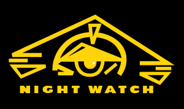

# DESI Nightwatch

[](https://nightwatch.readthedocs.io/en/latest/?badge=latest)

### Real-time DESI data quality monitoring



Nightwatch is a Python package that generates and displays realtime quality assurance (QA) metrics for nightly DESI observing shifts. It calculates metrics at the level of individual DESI fibers, CCD amplifiers, CCD cameras, and spectrographs.

DESI Support Observing Scientists (SOs) use the QA from DESI shifts posted on the [main Nightwatch website at NERSC](https://nightwatch.desi.lbl.gov/nights.html). Non-expert instructions and example plots are posted to the [Nightwatch page](https://desi.lbl.gov/trac/wiki/DESIOperations/NightWatch/NightWatchDescription) on the DESI wiki.

The design of Nightwatch is based on experience and lessons learned from SDSS SOS and prior work on the DESI QuickLook and QuickLook Framework. Past and current contributors are [listed here](https://github.com/desihub/nightwatch/graphs/contributors>).

### Overview

The Nightwatch software runs at KPNO and NERSC and splits its work into three steps: (1) process exposure data as they are recorded on disk; (2) compute quality assurance (QA) metrics for the data; (3) generate plots and HTML pages to display the QA results for monitoring by DESI observers.

These steps can be run individually on a single exposure or in an automated mode that monitors a directory for new input data. In automated mode, Nightwatch will run all the necessary steps on the latest exposures before returning to look for additional new data.

### Usage

The Nightwatch program is a front-end for a variety of difference tasks related to exposure processing, QA generation, and plot and table generation. These are broken out so that each one can be run and tested separately if need be. To see the list of available subcommands and their options, run the command-line option

```
nightwatch --help
```
