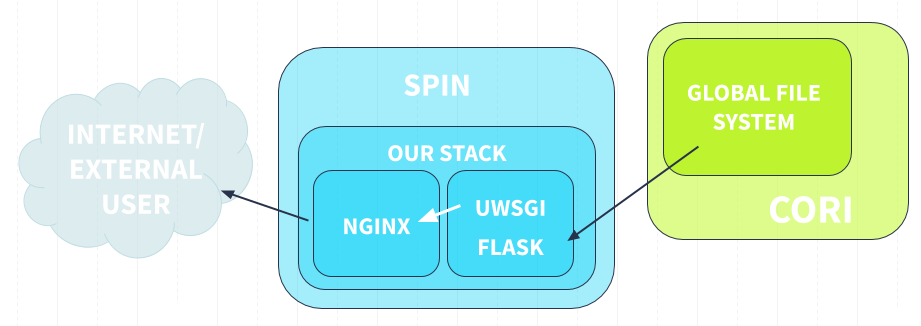

# Running A Containerized Nightwatch 
This tutorial will go through the process of setting up a stack to run Nightwatch on Spin, or on a local machine, in addition to documenting the configurations and default images built for Nightwatch.

#### Useful resources:
- Spin has some tutorials if you want to go through [building a Docker image](https://docs.nersc.gov/services/spin/getting_started/lesson-1/) or [starting up a basic stack](https://docs.nersc.gov/services/spin/getting_started/lesson-2/).

- [Docker documentation](https://docs.docker.com/) and [docker-compose documentation](https://docs.docker.com/compose/).

- [Nginx documentation](https://nginx.org/en/docs/).

- [uWSGI documentation](https://uwsgi-docs.readthedocs.io/en/latest/index.html).

## Contents
- [General Structure](#general-structure) 
- [Configuring Images](#configuring-images)
  - [uWSGI](#uwsgi)
  - [Nginx](#nginx)
- [Running At NERSC (Spin and Rancher)](#running-at-nersc)
  - [Starting the Stack](#starting-the-stack)
- [Docker-compose Reference](#docker-compose-reference)
  - [Mounting Volumes](#mounting-volumes)
  - [Setting Permissions](#setting-permissions)
  - [Some Useful Tips and Tricks](#some-useful-tips-and-tricks)
     * [Removing a Stack](#removing-a-stack)
     * [Shelling into a Stack](#shelling-into-a-stack)
     * [Upgrading a Stack](#upgrading-a-stack)
     * [Troubleshooting](#troubleshooting)

## General Structure
Our stack will consist of two separate containers, one running [Nginx](https://nginx.org/en/docs/) to serve as our frontend server, and one running [uWSGI](https://uwsgi-docs.readthedocs.io/en/latest/index.html), which will handle transferring requests between Nginx and our Flask web app. To coordinate these two containers, we have to use Docker-compose, which will allow the two containers to communicate properly. Spin, where we will run the stack at NERSC, handles the actual distribution of nodes and the connection to the internet. 



## Configuring Images
Generally, it shouldn't be necessary to modify the base Docker images, but this section will document the Dockerfiles and specific configurations in case modifications need to be made. 

### uWSGI

```
FROM python:3

WORKDIR /app
ENV PYTHONPATH ${PYTHONPATH}:./qqa/py
ENV PYTHONPATH ${PYTHONPATH}:./desimodel/py
ENV PYTHONPATH ${PYTHONPATH}:./desiutil/py
ADD . /app
RUN pip install -r requirements.txt
EXPOSE 5000

ENTRYPOINT [ "uwsgi" ]
CMD [ "--ini", "app.ini", "--pyargv", "-s ./static -d ./data"]
```

#### uWSGI Configuration
The uWSGI image also contains an app.ini file with uWSGI specific configurations:
```
[uwsgi]
protocol = http
module = app
callable = app
master = true

processes = 5
single-interpreter = true

http-socket = :5000
vacuum = true

die-on-term = true
```
See the [uWSGI documentation](https://uwsgi-docs.readthedocs.io/en/latest/CustomOptions.html) if you want to learn more about the specific options here. The version of the app.ini file in this repo also contains some more details on these configs.

### Nginx

```
FROM nginx:latest

RUN chgrp nginx /var/cache/nginx/
RUN chmod g+w /var/cache/nginx/

RUN sed --regexp-extended --in-place=.bak 's%(^\s+listen\s+)80(;)%\18080\2%' /etc/nginx/conf.d/default.conf
EXPOSE 80

RUN sed --regexp-extended --in-place=.bak 's%^pid\s+/var/run/nginx.pid;%pid /var/tmp/nginx.pid;%' /etc/nginx/nginx.conf
```

## Running at NERSC
## Starting the Stack
First step is accessing Spin, through Cori.
```
yourlocalmachine$ ssh [your username]@cori.nersc.gov
user@cori01: $ module load spin
```
Now, test your account:
```
user@cori01: $ spin-keygen.sh
Password for user ?
Success: Spin API Key generated for user.
user@cori01: $
```
Next, we want to define which rancher environment we are going to be using. There are two options: cattle-dev, and cattle-prod, the development and production environments, respectively. In this example, and for non-production state versions, we will choose cattle-dev. The environment variable is helpful, or rancher will ask us every time we try and do something to choose which environment we want to do it in.
```
user@cori01: $ export RANCHER_ENVIRONMENT=dev-cattle
```
Now, we will go to the directory we'll run the stack out of. First, create or go to a directory you want to pull the nightwatch repository into. Here, I'm exporting the path to an environment variable to make it easier to reference later.
```
user@cori01: $ export PROJECTDIR=path/to/where/you/want/the/project/
user@cori01: $ mkdir $PROJECTDIR && cd $PROJECTDIR
```
This directory should be in the global project system, as directories in scratch will not be able to access the files we need to mount. For example, this is my own directory structure that I use, all within my own global project filesystem directory:
```
├── qqatest
│   ├── output (static html files)
│   ├── data (data for dynamic stuff)
│   │   ├── output
├── qqa
|   ├── docker
|   |   ├── nightwatch-stack
|   |   |   ├── docker-compose.yml
|   |   |   ├── nightwatch.env.template
|   |   |   ├── web
|   |   │   │   ├── nginx.conf
├── desimodel
└── desiutil
```
Now, pull the repo:
```
user@cori01:PROJECTDIR $ git pull https://github.com/sbailey/qqa/
```
You should now have a qqa subdirectory with the same structure as outlined above. Go to the docker/nightwatch-stack directory. There should be a docker-compose.yml and nightwatch.env.template file. Copy the nightwatch.env.template file into another file called nightwatch.env, and open up the new file:
```
user@cori01:PROJECTDIR $ cp nightwatch.env.template nightwatch.env
user@cori01:PROJECTDIR $ vim nightwatch.env

#Default: DESI group id at NERSC
GROUP_ID=58102

#Directory relative to the docker-compose.yml containing static html files
STATIC_DIR=../qqatest/output

#Directory relative to docker-compose.yml containing fits data files
DATA_DIR=../qqatest/data/output

#Directory containing version of nightwatch code you want to run the app with
NIGHTWATCH_DIR=../qqa

#Directory containing desimodel code
DESIMODEL_DIR=../desimodel

#Directory containing desiutil code
DESIUTIL_DIR=../desiutil
```    
Edit the values of each of the environment variables to point to the correct directory; they can be relative to the docker-compose directory, or they can be absolute. User id is not included here, we will just export that value directly from the shell:
```
user@cori01:PROJECTDIR $ echo $UID
38305
user@cori01:PROJECTDIR $ export UID
```
Now, you should make sure that all of the directories that you are mounting to the docker-compose (that you just referenced in the nightwatch.env) have the correct permissions. Each directory and sub-directory that docker needs to get through to mount your external files needs to have the world executable bit (although not a world-readable bit).
```
user@cori01:PROJECTDIR $ chmod o+x [directory 1] [directory 2] [etc...]
```
Now, we will check that all of our environment variables are correctly assigned, and our docker-compose doesn't have any syntax errors.
```
user@cori01:PROJECTDIR $ rancher up --render --env-file nightwatch.env
```
This should print out the docker-compose.yml to the console if everything is correct.
```yaml
version: '2'
services:
  app:
    env_file: ./nightwatch.env
    image: registry.spin.nersc.gov/alyons18/app-uwsgi-flask:latest
    volumes:
     - ${STATIC_DIR}:/app/static
     - ${NIGHTWATCH_DIR}:/app/qqa:ro
     - ${DESIMODEL_DIR}:/app/desimodel:ro
     - ${DESIUTIL_DIR}:/app/desiutil:ro
     - ${DATA_DIR}:/app/data:ro
    user: ${UID}:58102
    entrypoint: uwsgi
    command:
     - --ini
     - app.ini
     - --pyargv
     - '-s ./static -d ./data'
     - --uid
     - '${UID}'
     - --gid
     - '58102'
    retain_ip: true
    cap_drop:
    - ALL
  web:
    env_file: ./nightwatch.env
    image: registry.spin.nersc.gov/alyons18/web-nginx:latest
    ports:
    - 60037:8080
    volumes:
    - ./web/nginx-proxy.conf:/etc/nginx/conf.d/default.conf:ro
    user: ${UID}:58102
    group_add:
    - nginx
    cap_drop:
    - ALL
```
*Note: you can replace the port above with any port you would like [(look at the Spin port guide)](https://docs.nersc.gov/services/spin/best_practices/#networking), but you will have to make sure to change it inside the web/nginx-proxy.conf file as well. This file contains specific nginx configurations, which will allow it to act correctly as a reverse proxy for our flask app:*
```conf
server {
    listen 8080;
    location / {
      proxy_pass http://app:5000;
      proxy_redirect http://$host:8080 http://$host:60037;
      proxy_set_header Host $host:60037;
      proxy_set_header X-Forwarded-For $proxy_add_x_forwarded_for;
      proxy_set_header X-Forwarded-Host $server_name;
      proxy_set_header X-Real-IP $remote_addr;
    }
}
```
*Again, if you chose a port other than 60037, replace 60037 with your port in the file above. This file tells nginx to pass all requests it receives to the proxy http://app:5000, which is where uWSGI is listening (see the app.ini file). On the way back, we need to tell nginx to direct traffic from the internal port it listens on (8080), to the external port the user is accessing (60037, in this case), hence the proxy_redirect statement. The other lines set the header on the requests going to uWSGI, and can be further configured to adjust security.*

So, after we've verified the docker-compose, we can start up the stack. The `-d` flag runs the process in the background, and `--stack` assigns a name to our stack. `--env-file` allows us to tell rancher which env file to reference. 
Note: the name of the stack should follow naming conventions. See [Spin naming conventions](https://docs.nersc.gov/services/spin/best_practices/#naming-convention-for-stacks).
```
user@cori01:PROJECTDIR $ rancher up -d --stack [stack-name] --env-file nightwatch.env
```
If everything is in order, then calling
```rancher ps```
should return that both of our services, app and web, are healthy. 
```bash
user@cori01:SPIN_DIRECTORY $ rancher ps
ID        TYPE      NAME                       IMAGE                                                             STATE      SCALE     SYSTEM    ENDPOINTS   DETAIL
1s13343   service   stack-name/web       registry.spin.nersc.gov/alyons18/web-nginx:latest                 healthy    1/1       false                 
1s13368   service   stack-name/app       registry.spin.nersc.gov/alyons18/app-uwsgi-flask:latest           healthy    1/1       false                 
```
To check the logs if there is an issue:
```
user@cori01:SPIN_DIRECTORY $ rancher logs service-name --follow --tail 100
```
The `--follow` tag will print the logs out realtime to the console, while the `--tail` option will only print out the last, in this case 100, lines of the log. 
In order to visit the service, you can check where it is being hosted:
```
rancher inspect your-stack-name/web | jq '.fqdn'
```
Which should return a name like web.stack-name.dev.stable.spin.nersc.org:{your external nginx port}, which you can navigate to in your browser. Or, you can use the IP address (although this changes periodically, the url is more reliable). To check the port or the IP address, you can use:
```
rancher inspect your-stack-name/web | jq '.publicEndpoints'
[
  {
    "hostId": "1h83",
    "instanceId": "1i2601738",
    "ipAddress": "some ip address",
    "port": 60037,
    "serviceId": "1s4783",
    "type": "publicEndpoint"
  }
]
```
If everything went properly, you should see the nightly calendar pop up when you navigate to the address, and voilà!

## Docker-compose reference
So we've started up our stack, but what do all the configurations mean? Here's an overview of the different sections of the docker-compose.yml.

### Mounting Volumes
We don't want to include all of our files in the build context for our images, otherwise they would get way too large very quickly. Mounting files externally also means we don't need to build a new image if we want to use new data, or change our code. We need to mount the external directories containing these files into our container. In our docker-compose, volumes are assigned in the `volumes` section of each service (as one might expect). Here, we are using docker volumes, although there are other ways to mount external files into a container (see the [docker-compose documentation](https://docs.docker.com/compose/compose-file/compose-file-v2/#volumes)).
The syntax for mounting a volume is as follows:
```yaml
volumes:
    - /external/path:/internal/path:mode
```
The path to the external directory (relative to the docker-compose.yml!), then the mountpoint within the directory, then the mode (here, mostly ro, or read-only). These are the volumes we need:
1. Static html files, mounted to /app/static
2. Processed data files, mounted to /app/data
3. Nightwatch, desimodel, and desiutil code, mounted to respective directories inside the /app directory
4. The nginx.conf file created above, mounted into the nginx container (you can copy and paste what I have below, as it should have the same relative directory structure)
We set the external paths to each of these through the nightwatch.env file.

### Setting Permissions
Running at Spin means that our services need to comply with their [security requirements](https://docs.nersc.gov/services/spin/best_practices/#security). We need to be running the container as a non-root user, specifically one with permissions to access these files and make modifications. This also improves security, as we will be removing almost all of the capabilities that a root user would have.

We took care of the permissions issue by putting our uid and group id into the docker-compose under the `user` section of both services, but there are some specific issues with how uWSGI runs that mean we need to reiterate this. In particular, uWSGI expects to be a root user to start, and to be switched later to a specific user and group. We need to tell it not to expect this, or our application will get stuck in the starting up phase. To do this, we added the following section to the app service in our docker-compose.yml.
```yaml
    entrypoint: uwsgi
    command:
     - --ini
     - app.ini
     - --pyargv
     - '-s ./static -d ./data'
     - --uid
     - '${UID}'
     - --gid
     - '58102'
```
This is basically the same command as we saw the the app Dockerfile, but by placing it in the docker-compose, the uWSGI container begins expecting to be a non-root user.

In addition, the `cap_drop` section of both the app and web services makes sure that all privileges associated with a root user get removed, improving security even further.

### Some Useful Tips and Tricks
These are just a mix of things I learned that were useful while trying to get this to work, in addition to some stuff not covered above, but useful for continuing development.
#### Removing a Stack
Sometimes when trying to start up a stack, something goes wrong enough for the stack to get stuck, or it to just be more convient to start over again. If this happens, you want to be able to totally remove that stack (this will not affect the actual docker-compose or other file you have stored!). To do this:
```
user@cori01:PROJECTDIR $ rancher rm --type stack [stack-name]
```
Or, to remove only one service:
```
user@cori01:PROJECTDIR $ rancher rm --type service [stack-name]/[service-name]
```
If you check your stacks with `rancher ps` now, you should not see the services you have removed.
Additionally, if you only want to stop a stack, instead of removing it entirely, you can do:
```
user@cori01:PROJECTDIR $ rancher stop [stack-name]
```
#### Shelling into a Stack
If you want to modify something or check anything about a container that is running, you can use `rancher exec` to create a shell inside the container. For example, you can check the container files:
```
user@cori01:PROJECTDIR $ rancher exec -it [stack-name] /bin/bash
root@1c442b1d19a3:/# ls
bin dev home lib64 mnt proc run srv tmp var
boot etc lib media opt root sbin sys usr
root@1c442b1d19a3:/# exit
exit
user@cori01:PROJECTDIR $
```
#### Upgrading a Stack
Once a stack is up and running, if you want to make modifications to it, you need to go through the process of upgrading it; for example, if you change something in the docker-compose.yml. After making your modification, run:
```
user@cori01:PROJECTDIR $ rancher up --upgrade -d --env-file nightwatch.env
INFO[0000] [app]: Creating
INFO[0000] [web]: Creating
INFO[0000] [app]: Created
INFO[0000] [web]: Created
INFO[0000] [web]: Starting
INFO[0000] [app]: Starting
1s3042
INFO[0000] [app]: Started
INFO[0000] Upgrading app
1s3041
INFO[0008] [web]: Started
```
You should see the line indicating the service is being upgraded, as above. Now, you can check that the upgrade was implemented by visiting the service wherever it is being hosted. Additionally, you can call `rancher ps --containers --all` to check that there are now two versions of your service, one running and upgraded, the other, older version, stopped. If you are satisfied that everything went well with the upgrade, you now need to confirm it:
```
user@cori01:PROJECTDIR $ rancher up -d --upgrade --confirm-upgrade --env-file nightwatch.env
```
If you check your containers again, the old stopped one should be gone.

Note: if you want to learn more about the rancher CLI and what you can do with it, look [here](https://docs.nersc.gov/services/spin/tips_and_examples/).

#### Troubleshooting
These are a couple of the things I noticed were most likely to have gone wrong when I was trying to get Nightwatch up and running.
 1. **User permissions:** who can access the files you are trying to get to? Are all the directories top to bottom set properly? Who is the container running as, who does the image expect to be running as?
 2. **Ports:** is the port you are accessing internal or external? Where are the services connected and how?
 3. **Correct directory?:** When starting a stack, make sure you are in the directory with the same name

